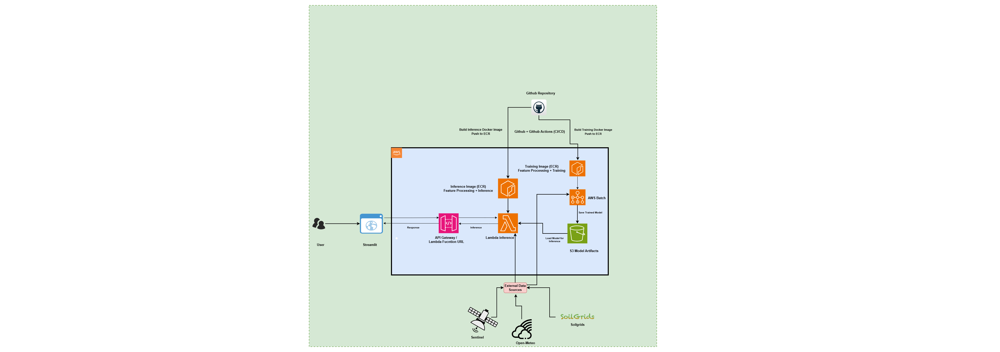

# TerraSignal — Crop Stress Platform

ML platform for predicting crop stress in UK arable fields using Sentinel-2 satellite imagery, weather, and soil data.

## Architecture



## Overview

```
Sentinel-2 bands + weather + soil → XGBoost model → stress_index (0–1)
```

Stress levels: **low** < 0.3 · **moderate** 0.3–0.6 · **high** > 0.6

## Project Structure

```
src/
  ingestion/        # Sentinel-2 (WCS), weather (Open-Meteo), soil (SoilGrids)
  processing/       # Cloud masking, raster clipping, spectral indices
  features/         # Feature engineering (satellite, weather, soil)
  training/         # XGBoost training, evaluation, SHAP explainability
  inference/        # Lambda handler + predictor
pipelines/          # End-to-end local pipeline
dashboard/          # Streamlit UI
infrastructure/     # AWS SAM template + Step Functions state machine
tests/              # Unit tests
```

## Setup

```bash
conda create -n agriai python=3.11
conda activate agriai
pip install -r requirements.txt
```

Create a `.env` file in the project root:

```
COPERNICUS_EMAIL=your@email.com
COPERNICUS_PASSWORD=yourpassword
SH_INSTANCE_ID=your-sentinel-hub-instance-id
```
